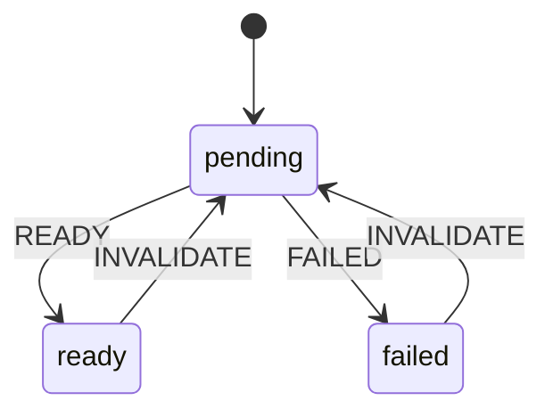

# Máquinas de estado de la interfaz

Todo el estado de la UI se modela con **XState v5** ([decisión 18](decisiones.md)). Esta página es la referencia viva de cada máquina: diagrama, eventos y efectos. **Convención:** el commit que toca una máquina actualiza su diagrama aquí — si el diagrama y `machines/` divergen, es un bug de revisión.

Principios:

- **La URL manda.** La ruta (`/{site}/{product}/{time}` + `?opacity&base`) es la fuente de verdad de lo compartible. Los cambios de ruta —incluido back/forward del navegador— entran a la máquina como evento `ROUTE_CHANGED`; las transiciones que cambian la selección navegan como efecto (`push`/`replace`). La máquina nunca contradice la barra de direcciones.
- **Máquinas puras.** Viven en `machines/`, sin tocar DOM ni router: los efectos (navegación, localStorage, fetch) se inyectan como input/actores, así los unit tests corren con `createActor` sin montar nada.
- **Estado efímero también aquí.** Opacidad, cursor o progreso de buffer no viajan en la URL, pero sí viven en el contexto de la máquina (eventos `SET_OPACITY`, `CURSOR_MOVE`, …).

## Inventario

| Máquina | Fichero | Responsabilidad | Estado |
|---|---|---|---|
| `viewerMachine` | `machines/viewer.ts` | Raíz de la página viewer: selección, carga del raster, timeline, prefs | implementada |
| `animationMachine` | `machines/animation.ts` | Playback: buffering, play/pause, reloj, dwell | implementada |
| `frameMachine` | `machines/frame.ts` | Ciclo de vida de un frame del pool (pending → ready/failed) | implementada |

## `viewerMachine`

Raíz de la página `pages/[site]/[product]/[[time]].vue`, `type: 'parallel'` con
dos regiones concurrentes: **`raster`** (el frame mostrado) y **`timeline`**
(los rasters del día). Cada región deriva su estado inicial de un fetch hecho
en SSR (`initialRaster`/`initialError` y `initialTimes`/`initialTimelineError`)
vía su propio pseudo-estado `init` — sin trabajo async, el snapshot pre-start
es idéntico en servidor y cliente (hidratación segura; el actor arranca en
`onMounted`).

**Nota de implementación (XState v5):** en una máquina paralela, un `on` a
nivel raíz queda ensombrecido en cuanto *cualquier* región define su propio
`on` para el mismo evento — el evento se da por manejado en esa región y no
burbujea al padre. Por eso `ROUTE_CHANGED` se maneja **dentro de cada
región**, no en la raíz; `assignRoute`/`persistPrefs` corren en la región
`raster` (declarada primero, se ejecuta antes que `timeline` en el mismo
micropaso, así `timeline` ya lee el contexto actualizado). Confirmado con un
test canario antes de fiarse de este comportamiento.

```mermaid
stateDiagram-v2
    state "raster" as R {
        [*] --> r_init
        r_init --> r_shown: initialRaster ≠ null
        r_init --> r_empty: closest SSR dio 404
        r_init --> r_error: fallo del closest SSR
        r_loading --> r_shown: fetchClosest → raster
        r_loading --> r_empty: fetchClosest → 404
        r_loading --> r_error: fetchClosest falla
        r_shown --> r_loading: ROUTE_CHANGED ¬sameFrame
        r_empty --> r_loading: ROUTE_CHANGED ¬sameFrame
        r_error --> r_loading: ROUTE_CHANGED ¬sameFrame
        r_loading --> r_loading: ROUTE_CHANGED ¬sameFrame (cancela el fetch en vuelo)
        r_shown --> r_steppingNext: STEP +1 (sin vecino local)
        r_shown --> r_steppingPrev: STEP -1 (sin vecino local)
        r_steppingNext --> r_shown: fetchStep → raster (navigate replace) / 404 (atEnd)
        r_steppingPrev --> r_shown: fetchStep → raster (navigate replace) / 404 (atStart)
    }
    --
    state "timeline" as T {
        [*] --> t_init
        t_init --> t_ready: initialTimes.length > 0
        t_init --> t_empty: initialTimes vacío
        t_init --> t_error: fallo del /api/rasters/day SSR
        t_loading --> t_ready: fetchDay → times
        t_loading --> t_empty: fetchDay → []
        t_loading --> t_error: fetchDay falla
        t_ready --> t_loading: ROUTE_CHANGED ¬sameDay
        t_empty --> t_loading: ROUTE_CHANGED ¬sameDay
        t_ready --> t_jumping: SELECT_DAY ¬sameDaySelected
        t_empty --> t_jumping: SELECT_DAY ¬sameDaySelected
        t_jumping --> t_ready: fetchDay → times (+ navigate push al último vol_time)
        t_jumping --> t_empty: fetchDay → [] (sin frame al que saltar, la URL no cambia)
    }
```

**Contexto:** `radars`, `products`, `site`, `product`, `time` (ISO naive; `null` = vista live), `nowT` (instante SSR), `raster`, `rasterError`, `day` (YYYY-MM-DD que la región `timeline` tiene cargado/objetivo), `times`, `timelineError`, `atStart`/`atEnd` (404 ya confirmado en esa dirección — deshabilita el botón), `opacity`, `base`, `cursor`, `cogError`.

| Evento | Región | Efecto |
|---|---|---|
| `ROUTE_CHANGED` | `raster` | guard `sameFrame` (site+product+time sin cambios reales) → asigna contexto + `persistPrefs`; si no → `.loading` (reentrar cancela el fetch en vuelo, resetea `atStart`/`atEnd`) + `persistPrefs` |
| `ROUTE_CHANGED` | `timeline` | guard `sameDay` (site+product+día sin cambios — cubre stepping dentro del día) → nada; si no → `.loading` con el `day` derivado del nuevo `time` |
| `STEP(dir)` | `raster` | vecino local en `context.times` → `navigate` replace directo (sin roundtrip); si no hay vecino y esa dirección ya está confirmada (`atStart`/`atEnd`) → no-op; si no → `.steppingNext`/`.steppingPrev` (llama `/api/rasters/{next,prev}`: éxito navega replace, 404 marca `atStart`/`atEnd` y se queda en el frame actual, sin error visible) |
| `SELECT_TIME(time)` | — | click en un tick de la timeline → `navigate` replace directo |
| `SELECT_DAY` | `timeline` | guard `sameDaySelected` → nada; si no → `.jumping`: al resolver, si el día tiene datos, salta (push) al último `vol_time`; si no, se queda en `empty` sin tocar la URL (nada a lo que saltar) |
| `MOUNTED` | — | guard (time `null` + raster resuelto) → efecto `navigate` replace al `vol_time` (la URL siempre contiene el frame exacto) |
| `SELECT_SITE` / `SELECT_PRODUCT` | — | efecto `navigate` push — la máquina **no** refetchea aquí; el refetch llega por `ROUTE_CHANGED` en cada región (URL manda) |
| `SET_OPACITY` | — | asigna contexto + `persistPrefs` + `syncQuery` (query `?opacity` con replace debounced 300 ms, omitida si es el default 0.8) |
| `CURSOR_MOVE` / `COG_ERROR` | — | asignan contexto |

**Corrección de URL generalizada:** cuando `fetchClosest` resuelve, si el `vol_time` devuelto difiere del `time` pedido (vista live, o cualquier instante que no coincide con un vol_time real — p.ej. el `SELECT_DAY` pide "fin de día" implícitamente vía `/api/rasters/day` y salta al último real), se hace `replace`/`push` al `vol_time` exacto. La URL nunca muestra un instante distinto del frame realmente exhibido (puerta M3).

**Assign optimista de `context.time`:** toda acción que navega con un `time` (`STEP`, `SELECT_TIME`, `MOUNTED`, la corrección de mismatch, el éxito de `steppingNext/Prev`/`jumping`) asigna `context.time` en el mismo paso, no solo el efecto `navigate`. `router.replace()`/`push()` resuelve async y el watcher de ruta de la página reacciona un tick después (evento `ROUTE_CHANGED`); sin el assign optimista, un segundo evento disparado de inmediato (doble click, tecla repetida) leería `context.time` desactualizado y calcularía el siguiente salto desde la posición vieja. Reproducido con un e2e de stepping rápido por teclado antes de aplicar el fix — cuando `ROUTE_CHANGED` finalmente llega, `assignRoute` reconfirma el mismo valor (no-op).

**Prefs (`lamula:prefs` en localStorage, nunca el `time` ni el `day`):** toda navegación (`ROUTE_CHANGED`) y todo cambio de opacidad disparan `persistPrefs` con `{site, product, opacity, base}` — así `/` siempre redirige a la última selección real, no a un valor mudo. `composables/useViewerPrefs.ts` valida versión/shape al leer (corrupto o `v` desconocida → `null`, no rompe la redirección).

**Dependencias inyectadas** (`.provide()` en la página; mocks en tests): actores `fetchClosest` (`$fetch` a `/api/rasters/closest`, 404 → `null`), `fetchDay` (`$fetch` a `/api/rasters/day`) y `fetchStep` (`$fetch` a `/api/rasters/{next,prev}`, 404 → `null` — solo se llama al agotar los vecinos locales de `context.times`, es decir al cruzar el día); acciones `navigate` (router push/replace conservando query, `composables/useViewerRoute.ts`), `persistPrefs` (`savePrefs`) y `syncQuery` (replace debounced de `?opacity&base`, ambas en la página).

**Day picker (`components/DayPicker.vue`):** botones de día UTC sobre la ventana de 72h anclada a `radar.last_seen_at` (`utils/time-window.ts::dayWindow72h`, decisión 11) — no wall-clock, así un radar muerto sigue mostrando sus días con datos y las fixtures no se pudren. Click → evento `SELECT_DAY`.

**Timeline strip (`components/TimelineStrip.vue`):** strip proporcional al rango `[times[0], times.at(-1)]` del día cargado; un tick por `vol_time` (click → `SELECT_TIME`), huecos marcados cuando el intervalo excede `max(2×mediana, 10 min)` (`utils/timeline/gaps.ts::computeGaps` — con menos de 3 times no hay señal para una mediana, no se marcan huecos), botones prev/next (→ `STEP`) deshabilitados según `atStart`/`atEnd`. Teclado: `←`/`→` en `window` disparan `STEP`, ignorados con foco en `input`/`select`/`textarea`.

## `frameMachine`

Ciclo de vida de UN frame del pool de animación, spawneado por `animationMachine` (uno por índice, no hay estado duplicado fuera del árbol de actores). El driver real (`utils/map/frame-pool.ts`) es quien decide cuándo un frame está listo — detecta `renderComplete` de su capa WebGL y llama `FRAME_READY`/`FRAME_FAILED` en la máquina padre, que reenvía `READY`/`FAILED` al hijo correspondiente.



`INVALIDATE` lo envía `animationMachine` en `MOVE_END` a todos los frames salvo el activo (pan/zoom: sus tiles cacheados ya no sirven bajo el nuevo extent, vuelven a prefetchear).

## `animationMachine`

Playback de la serie del día: `idle → buffering → paused ⇄ playing`. Pura — no toca OL ni DOM; el pool real (`utils/map/frame-pool.ts`) decide *cuándo* un frame está listo, esta máquina decide *qué* mostrar y cuándo avanzar. `SET_FRAMES` spawnea un `frameMachine` hijo por índice (ids únicos por generación — evita colisión al reemplazar la serie de un día por la de otro).

```mermaid
stateDiagram-v2
    [*] --> idle
    idle --> buffering: SET_FRAMES
    buffering --> buffering: SET_FRAMES (nueva generación)
    buffering --> paused: frame(index) ready
    buffering --> paused: todos resueltos (ready/failed) — salta a uno ready si hay, si no se queda igual
    paused --> playing: PLAY / TOGGLE
    playing --> playing: FRAME_DELAY (avanza si el siguiente está ready; hold si pending; salta si failed)
    playing --> paused: PAUSE / TOGGLE
    paused --> idle: MOVE_END (invalida los frames inactivos)
    playing --> paused: MOVE_END (pausa + invalida los inactivos)
```



**Contexto:** `frames` (refs a `frameMachine` hijos), `gen` (generación, para ids únicos al respawnear), `index` (frame mostrado), `fps`, `lastFrameDwellMs`.

| Evento | Efecto |
|---|---|
| `SET_FRAMES(count, startIndex?)` | detiene los hijos de la generación anterior, spawnea `count` nuevos, `index = clamp(startIndex ?? 0)` → `.buffering`. **`startIndex` es obligatorio en la práctica**: sin él, el buffer siempre esperaría el frame 0 aunque el viewer ya estuviera mostrando otro — bug real encontrado en el primer e2e de animación (ver más abajo) |
| `FRAME_READY(i)` / `FRAME_FAILED(i, msg)` | reenvía `READY`/`FAILED` al `frameMachine` hijo `i` — válido en cualquier estado |
| `PLAY` / `TOGGLE` (en `paused`) | → `playing` |
| `PAUSE` / `TOGGLE` (en `playing`) | → `paused` |
| `SEEK(i)` | asigna `index` (clamped); manejado en `buffering`/`paused`/`playing` |
| `MOVE_END` | invalida (`INVALIDATE`) todos los hijos salvo el activo → `paused` (no sigue animando sobre un extent que ya no corresponde a los demás frames; el activo se conserva, sin corte visual) |

**Salida de `buffering` sin bloqueo permanente:** el caso feliz es "el frame objetivo (`context.index`) está `ready`". Si ese frame específico *falla* (404 real, no un hueco transitorio), esperar solo por él colgaría la UI para siempre — por eso hay una segunda condición: en cuanto **todos** los hijos terminan de resolver (ninguno sigue `pending`), se sale igual, saltando a un índice `ready` si existe alguno; si absolutamente todos fallaron, se sale sin más (nada que mostrar, degradación vía `rasterError` del pool, no un buffering infinito).

**Avance en `playing` (`nextPlayableIndex`):** un frame `failed` (hueco real) se salta de forma transparente; uno `pending` frena el avance (se reintenta el próximo tick, no se salta — una descarga lenta no se confunde con un hueco permanente). El delay entre frames (`FRAME_DELAY`) es `1000/fps`, salvo en el último índice de la serie, donde usa `lastFrameDwellMs` antes de reiniciar el ciclo.

**Bug real encontrado con e2e (no solo unitario):** el primer intento de `SET_FRAMES` reseteaba `index` a `0` incondicionalmente; la página mandaba un `SEEK` aparte para corregirlo, pero `buffering` no manejaba `SEEK` en ese momento (evento ignorado silenciosamente) — el buffer esperaba el frame equivocado durante ~1 s hasta que el fallback de "todos resueltos" lo rescataba. Fix: `SET_FRAMES` acepta `startIndex` y fija el índice correcto en el mismo paso (además, `buffering` ahora sí maneja `SEEK` por robustez). Ilustra por qué la puerta de animación necesita e2e real, no solo tests de la máquina en aislamiento — el bug era de *integración* (dos eventos separados con una ventana de estado inválida en medio), invisible probando la máquina con un solo evento a la vez.

**Orquestación en la página** (`pages/[site]/[product]/[[time]].vue`): modo estático (F2, `RadarMap` con `:raster`) hasta que el usuario presiona play por primera vez (`animationEngaged`); a partir de ahí `RadarMap` pasa a modo pool (`:frames`) y lo mantiene aun en pausa (el scrubbing reutiliza el mismo pool, sin destruir/recrear capas). Mientras la animación está pausada, `context.time` de `viewerMachine` y `context.index` de `animationMachine` se mantienen sincronizados en ambas direcciones (stepping externo → `SEEK`; `PLAY`/`TOGGLE` al pausar → `SELECT_TIME` con replace) — decisión F3: **durante playback la URL no se toca**, solo al pausar.

## Pool de capas WebGL (`utils/map/frame-pool.ts`)

No es una máquina XState — es el driver imperativo que habla con OpenLayers y alimenta `FRAME_READY`/`FRAME_FAILED`. Verificado contra `node_modules/ol` 10.9.0:

- Una `WebGLTileLayer` + `GeoTIFF` **por frame** (no una sola capa con `setSource()`: eso dispone las texturas cacheadas y produce parpadeo).
- `visible:false` no carga tiles; `opacity:0` sí — el prefetch en segundo plano es una capa `visible:true, opacity:0`; al quedar lista y no ser la activa, se oculta (`visible:false`, cero costo de render).
- N capas con el mismo `className`/zIndex contiguo comparten **un solo contexto WebGL** — sin límite práctico de contextos, y ayuda en CI (SwiftShader pierde contexto con concurrencia).
- "Frame listo" = `layer.getRenderer().renderComplete`, muestreado en el `postrender` del mapa. Es una propiedad **semi-pública** del renderer (no forma parte de la API documentada de ol) — protegida por el canario `tests/unit/render-complete-canary.spec.ts`; si un upgrade de `ol` la renombra o la quita, ese test falla antes que el pool deje de avanzar en silencio. Plan B si se rompe: `rendercomplete` secuencial del mapa (más lento, 100 % API pública).
- Prefetch acotado a `PREFETCH_CONCURRENCY = 3` concurrentes; tope de seguridad `MAX_POOL = 24` frames (memoria) — 20 frames típicos caben sin evicción.
- `invalidateInactive()` (llamado en `moveend` del mapa): el frame activo se conserva; el resto vuelve a `'loading'` y se re-prioriza.

**Limitación conocida de los goldens/fixtures para e2e:** solo el `vol_time` más reciente de cada `(site, product)` tiene un COG golden commiteado (`tests/fixtures/cogs/r2/`) — el resto 404 en el entorno offline de CI. Los e2e de animación (`e2e/animation.spec.ts`) validan que la máquina no se cuelga y el ciclado es correcto ante fallos reales, pero **no** pueden validar el ciclado fluido de múltiples frames reales cargando a la vez; eso es la puerta manual contra datos vivos (`docs/validaciones.md`).
