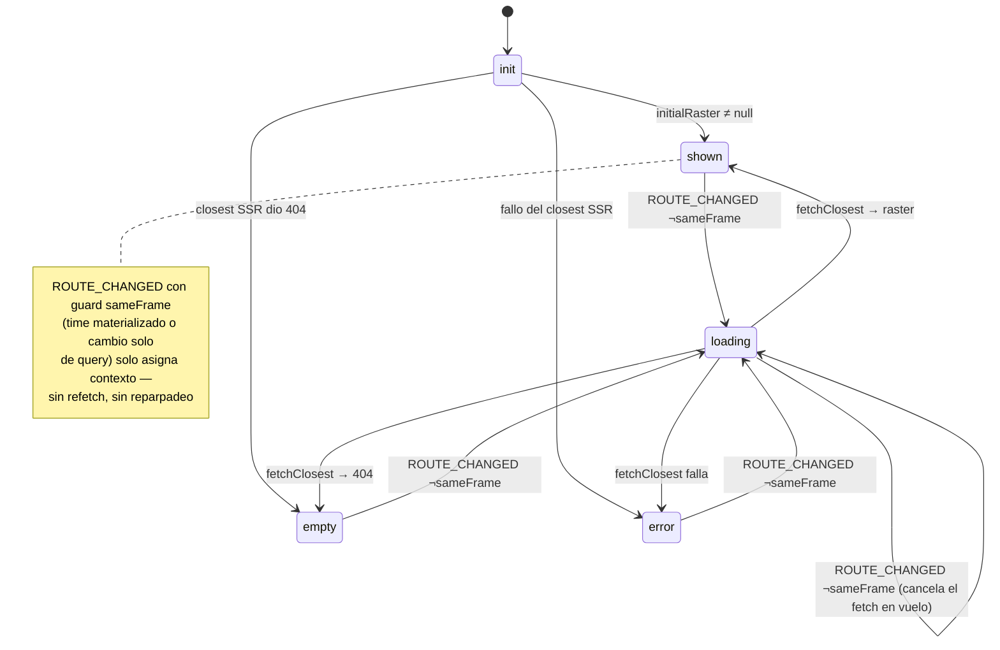

# Máquinas de estado de la interfaz

Todo el estado de la UI se modela con **XState v5** ([decisión 18](decisiones.md)). Esta página es la referencia viva de cada máquina: diagrama, eventos y efectos. **Convención:** el commit que toca una máquina actualiza su diagrama aquí — si el diagrama y `machines/` divergen, es un bug de revisión.

Principios:

- **La URL manda.** La ruta (`/{site}/{product}/{time}` + `?opacity&base`) es la fuente de verdad de lo compartible. Los cambios de ruta —incluido back/forward del navegador— entran a la máquina como evento `ROUTE_CHANGED`; las transiciones que cambian la selección navegan como efecto (`push`/`replace`). La máquina nunca contradice la barra de direcciones.
- **Máquinas puras.** Viven en `machines/`, sin tocar DOM ni router: los efectos (navegación, localStorage, fetch) se inyectan como input/actores, así los unit tests corren con `createActor` sin montar nada.
- **Estado efímero también aquí.** Opacidad, cursor o progreso de buffer no viajan en la URL, pero sí viven en el contexto de la máquina (eventos `SET_OPACITY`, `CURSOR_MOVE`, …).

## Inventario

| Máquina | Fichero | Responsabilidad | Estado |
|---|---|---|---|
| `viewerMachine` | `machines/viewer.ts` | Raíz de la página viewer: selección, carga del raster, timeline, prefs | implementada |
| `animationMachine` | `machines/animation.ts` | Playback: buffering, play/pause, reloj, dwell | pendiente (F3 paso 6) |
| `frameMachine` | `machines/frame.ts` | Ciclo de vida de un frame del pool (prefetch → ready/failed) | pendiente (F3 paso 6) |

## `viewerMachine`

Raíz de la página `pages/[site]/[product]/[[time]].vue`. El estado inicial se
deriva del closest hecho en SSR (input `initialRaster`/`initialError`) vía el
pseudo-estado `init` — sin trabajo async, el snapshot pre-start es idéntico en
servidor y cliente (hidratación segura; el actor arranca en `onMounted`).

**Contexto:** `radars`, `products`, `site`, `product`, `time` (ISO naive; `null` = vista live), `nowT` (instante SSR), `raster`, `rasterError`, `opacity`, `base`, `cursor`, `cogError`.

| Evento | Efecto |
|---|---|
| `ROUTE_CHANGED` | guard `sameFrame` → asigna contexto + `persistPrefs`; si no → `.loading` (reentrar cancela el fetch en vuelo — sin respuestas stale) + `persistPrefs` |
| `MOUNTED` | guard `liveResolved` (time `null` + raster resuelto) → efecto `navigate` replace al `vol_time` (la URL siempre contiene el frame exacto) |
| `SELECT_SITE` / `SELECT_PRODUCT` | efecto `navigate` push — la máquina **no** refetchea aquí; el refetch llega por `ROUTE_CHANGED` (URL manda) |
| `SET_OPACITY` | asigna contexto + `persistPrefs` + `syncQuery` (query `?opacity` con replace debounced 300 ms, omitida si es el default 0.8) |
| `CURSOR_MOVE` / `COG_ERROR` | asignan contexto |

**Prefs (`lamula:prefs` en localStorage, nunca el `time`):** toda navegación (`ROUTE_CHANGED`) y todo cambio de opacidad disparan `persistPrefs` con `{site, product, opacity, base}` — así `/` siempre redirige a la última selección real, no a un valor mudo. `composables/useViewerPrefs.ts` valida versión/shape al leer (corrupto o `v` desconocida → `null`, no rompe la redirección).

**Dependencias inyectadas** (`.provide()` en la página; mocks en tests): actor `fetchClosest` (`$fetch` a `/api/rasters/closest`, 404 → `null`); acciones `navigate` (router push/replace conservando query, `composables/useViewerRoute.ts`), `persistPrefs` (`savePrefs`) y `syncQuery` (replace debounced de `?opacity&base`, ambas en la página).
