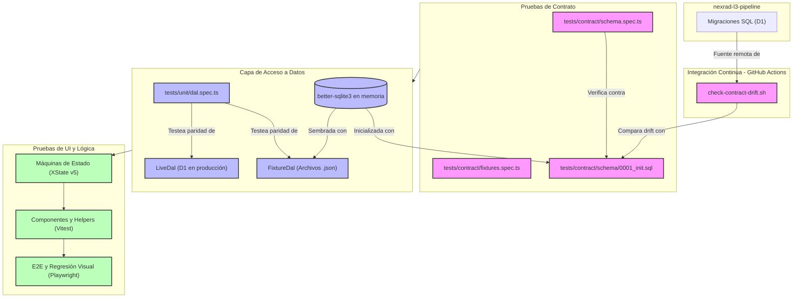
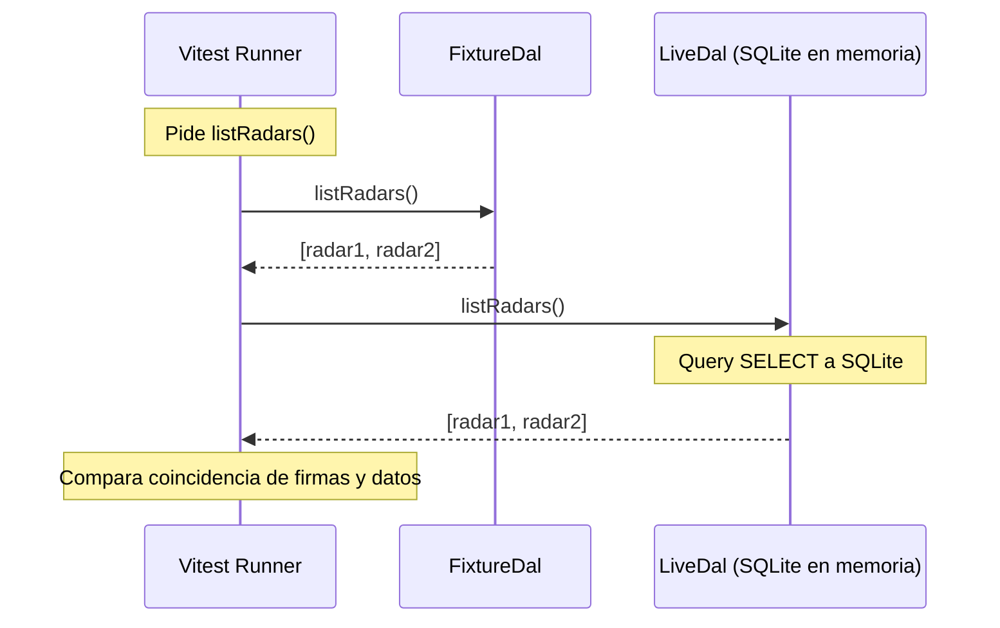
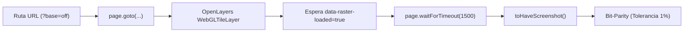

# Estrategia de Pruebas y Paridad de Datos

Esta sección describe detalladamente la suite de pruebas del visualizador de datos **LAMULA-WebViewer**, sus objetivos, cómo se relacionan con las especificaciones del software y cómo garantizan la estabilidad de la aplicación frente a cambios en el pipeline de datos (`nexrad-l3-pipeline`).

---

## 1. Filosofía de Desarrollo: Spec-and-Test-First

El proyecto sigue una estrategia basada en **puertas de validación por fase**. Los escenarios y la lógica de color, cálculo y navegación son definidos por el experto de dominio y el equipo de QA. Estos criterios se traducen directamente en aserciones de código y pruebas automáticas antes del desarrollo de cada fase.

### Flujo General de Verificación



---

## 2. Niveles de Pruebas en Detalle

La suite de pruebas se divide en 4 niveles bien diferenciados, cada uno atacando un riesgo del software específico.

### A. Pruebas de Contrato (Contract Tests)
* **Ubicación:** `tests/contract/`
* **Objetivo:** Garantizar que el visualizador y el pipeline coinciden exactamente en las tablas, tipos de columnas e índices requeridos.
* **Componentes clave:**
    * [schema.spec.ts](https://github.com/vladimir1284/lamula-webviewer/blob/main/tests/contract/schema.spec.ts): Levanta una base de datos en memoria (SQLite mediante `better-sqlite3`) utilizando el archivo SQL de snapshot [0001_init.sql](https://github.com/vladimir1284/lamula-webviewer/blob/main/tests/contract/schema/0001_init.sql). Verifica la existencia, nombres, tipo (TEXT, REAL, INTEGER) y nulabilidad de las columnas críticas en las tablas `radars`, `products`, `rasters`, `phenomena` y `vwp`.
    * [fixtures.spec.ts](https://github.com/vladimir1284/lamula-webviewer/blob/main/tests/contract/fixtures.spec.ts): Compara las grabaciones del adaptador de fixtures contra los esquemas Zod compartidos en [shared/contract](https://github.com/vladimir1284/lamula-webviewer/blob/main/shared/contract) e intenta insertarlos en la base de datos SQL real para verificar que las restricciones de clave foránea (FK) permanezcan válidas.
    * [check-contract-drift.sh](https://github.com/vladimir1284/lamula-webviewer/blob/main/scripts/check-contract-drift.sh): Script de bash que se ejecuta en CI. Descarga el SQL del repositorio remoto de pipeline y lo compara byte a byte con el snapshot local.

> [!IMPORTANT]
> **Relación con la especificación:** El visualizador es de **solo lectura**. Si el pipeline realiza una migración destructiva (elimina o renombra una columna), la prueba de contrato fallará en CI inmediatamente, protegiendo a producción antes de realizar un deploy. Las nuevas columnas no causan fallos (el pipeline puede expandirse libremente).

---

### B. Pruebas del DAL (Data Access Layer Parity)
* **Ubicación:** `tests/unit/dal.spec.ts`
* **Objetivo:** Garantizar paridad exacta de comportamiento entre el adaptador de producción (`LiveDal` interactuando con D1/R2) y el adaptador local de desarrollo (`FixtureDal` que trabaja offline sobre respuestas JSON estáticas).
* **Mecanismo:**
    * Se utiliza un runner de Vitest parametrizado que ejecuta exactamente la misma suite de aserciones contra ambos adaptadores.
    * Para simular la D1 de producción, se crea una base de datos `better-sqlite3` en memoria y se siembra con las mismas grabaciones en formato `.json` que usa el adaptador de fixtures.
    * Las expectativas y datos esperados (como los IDs de sitios de radares o el volumen de tormenta con mesociclones) no están hardcodeados; se derivan dinámicamente mediante [derive.ts](https://github.com/vladimir1284/lamula-webviewer/blob/main/tests/helpers/derive.ts) basándose en las grabaciones vigentes.



---

### C. Pruebas de Máquinas de Estado (Vitest + XState)
* **Ubicación:** `tests/unit/`
* **Objetivo:** Aislar y probar la lógica de flujo de la interfaz sin interactuar con el DOM del navegador.
* **Componentes clave:**
    * Pruebas para `viewerMachine` (gestión de frame actual y selección de radar).
    * Pruebas para `animationMachine` y `frameMachine` (orquestación del buffer pre-cargado de imágenes).
    * Pruebas para `overlayMachine` (coordinación paralela de celdas de tormenta, VWP y series temporales).
    * [render-complete-canary.spec.ts](https://github.com/vladimir1284/lamula-webviewer/blob/main/tests/unit/render-complete-canary.spec.ts): Prueba de advertencia ("canario"). El pool de frames necesita saber si un raster de OpenLayers ya se renderizó en la GPU mediante la propiedad interna de OpenLayers `WebGLTileLayer.getRenderer().renderComplete`. Este test asegura que ninguna actualización menor de la biblioteca `ol` renombre o elimine esta funcionalidad crítica.

> [!TIP]
> **Relación con la especificación:** El estado de la URL actúa como la fuente de verdad (Decisión de diseño 18). Las pruebas de XState garantizan que eventos como `TOGGLE_LAYER` o cambios en el path de la URL se sincronicen y propaguen en paralelo a todos los sub-estados de manera determinista.

---

### D. Pruebas Unitarias de Lógica y Componentes
* **Ubicación:** `tests/unit/`
* **Objetivo:** Verificar algoritmos puros de física, conversión y componentes pequeños.
* **Ejemplos significativos:**
    * [wind.spec.ts](https://github.com/vladimir1284/lamula-webviewer/blob/main/tests/unit/wind.spec.ts): Valida los cálculos matemáticos de conversión entre componentes u/v y velocidad/dirección para las barbas del VWP (perfil de vientos).
    * [palette.spec.ts](https://github.com/vladimir1284/lamula-webviewer/blob/main/tests/unit/palette.spec.ts): Verifica las escalas físicas de los 7 productos raster de reflectividad y velocidades, asegurando que las clases de colores se mapean en la leyenda correspondientemente.

---

### E. Pruebas E2E y de Regresión Visual (Playwright)
* **Ubicación:** `e2e/`
* **Objetivo:** Ejecutar escenarios de usuario final y validar visualmente que el renderizado de GeoTIFFs sea bit a bit idéntico.
* **Componentes clave:**
    * [golden.spec.ts](https://github.com/vladimir1284/lamula-webviewer/blob/main/e2e/golden.spec.ts): Descarga los COG golden en local, apaga el mapa base (`?base=off`) para aislar los píxeles de ruido geográfico y compara las capturas de pantalla tomadas del elemento `<canvas>` de OpenLayers contra goldens versionados (por ejemplo, `e2e/golden.spec.ts-snapshots/`).
    * **Ejecución en serie:** Debido a limitaciones del hardware de CI, la ejecución concurrente de múltiples contextos WebGL (usando SwiftShader en headless) puede colisionar o perder el contexto de la GPU. Por esta razón, el proyecto de Playwright para goldens corre en serie.



> [!WARNING]
> **Carrera de Hidratación en SSR (Nuxt 3):**
> Durante el renderizado en el servidor, los botones y selectores están visibles inmediatamente, pero los listeners de Vue pueden tardar cientos de milisegundos en adjuntarse. Si Playwright hace click antes de la hidratación completa, el evento puede perderse.
> * **Para acciones idempotentes (ej. `<select>`):** Usar Playwright `toPass` para reintentar la selección de opción de forma segura.
> * **Para acciones con estado (ej. botón play/pause):** Reintentar un click puede causar doble activación indeseada. El fix consiste en esperar explitamente a `page.waitForLoadState('networkidle')` antes de realizar el único click decisivo.

---

## 3. Resumen de Comandos de Pruebas

Para ejecutar las distintas pruebas en local:

```bash
# Correr todas las pruebas unitarias y de contrato de Vitest
pnpm test

# Correr pruebas unitarias en modo interactivo (watch)
pnpm test:watch

# Ejecutar la suite completa de pruebas E2E (Playwright)
pnpm test:e2e

# Actualizar capturas de pantalla de goldens visuales si hay cambios válidos en paletas
pnpm exec playwright test e2e/golden.spec.ts --update-snapshots
```
